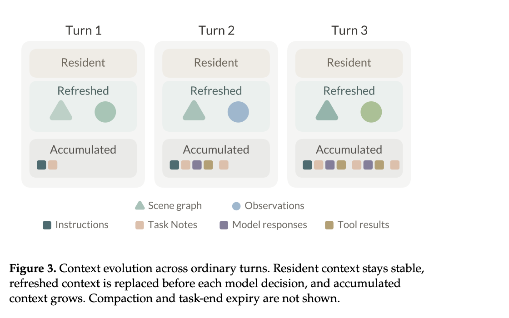
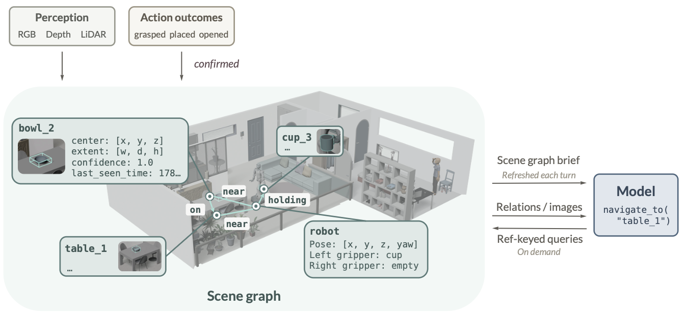
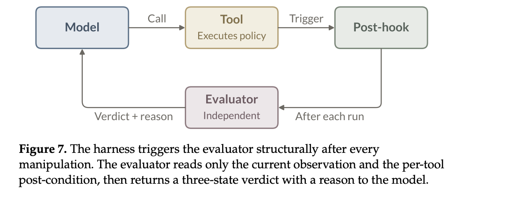

## 1. Harness 总体范式

### 核心思想

- **编排和执行解耦**：模型负责决定下一步做什么，具体怎么导航、怎么抓取，由工具背后的机器人策略执行。这样模型和机器人身体都可以替换。

- **能力来自组合**：Thea 不追求一个模型一次性解决长程任务，而是让导航、观察、抓取、询问用户、评估结果这些工具自由组合，长程行为从多步闭环里长出来。

- **闭环与判定才是重点**：物理动作会失败，但是现在模型不具备判定失败的能力，造成了闭环的缺失。引入判定的方法和整体流程。模型能看见世界状态、判断动作结果、知道失败原因，然后调整下一步。

## 2. Agent Loop与上下文管理

主控制循环让模型每轮读取上下文、选择一个工具、执行后观察结果，再决定下一步；它把长程物理任务拆成一步步可反馈、可恢复的过程。

### 图中三个 context 生命周期

- **Resident**：在任务开始时加载，并在任务过程中保持稳定。它包括 System Prompt、Memory、Embodiment Profile 和 Tool Definitions。

- **Refreshed**：这类上下文在每次模型决策前重新获取，表示 harness 当前对物理世界的判断。它包括 scene graph brief 和当前观测：前者提供全局、结构化的世界状态，后者提供相机图像和局部障碍距离等即时传感信息，两者共同让模型基于“现在的世界”行动。

- **Accumulated**：保存 session 内已经发生的事情，主要是任务进度、阶段性成果、相关交互记录。它包括用户指令、Task Notes、模型回复和工具结果，用来记录尝试过什么、返回了什么，从而支持后续恢复；当上下文接近窗口上限时，旧的 accumulated 内容会被压缩，而 resident 和 refreshed 内容会被保留。

## 3. Context / Scene Graph 仿真环境搭建

这一部分负责“让世界可读”，把传感器观测整理成持久的 scene graph，并在每轮给模型一个简洁的世界摘要；它解决物理世界不像代码库那样天然可搜索、可引用的问题。

### 问题

存储的是绝对位姿会有明显漂移。实际上应该存储为多层+空间拓扑关系：
大件物体应该是比较固定的方位信息（坐标信息），小件物体应该是相对空间关系————书本在桌子上方类似这样。
## 4. Tool / Skill 系统

工具把导航、抓取、查询、交互等能力包装成统一可调用接口；skill 则是按需加载的知识文本，用来补充任务规则、场景惯例或操作经验。

## 5. Evaluator 部分——判定机制

“让动作结果可验证”是形成闭环的关键。Evaluator负责判断动作是否成功、是否继续、失败原因是什么，支撑重试和恢复。

### 核心设计和理念

- **为什么关键**：coding agent 天然有 exit code、测试结果、报错栈，模型可以据此判断上一步是否成功；但物理世界不会主动告诉机器人“抓取成功”“杯子滑落”或“动作还没完成”，所以必须人为构造一个 evaluator 来补上这个反馈通道。

- **什么时候评估**：对于端到端机器人策略，动作本身没有天然结束信号，所以 evaluator 会在动作片段之间持续判断当前状态是 `process`、`success` 还是 `failure`。

### 具体判定方式

- **本质上是多模态模型基于视觉证据做动作结果判别**：论文实验中使用 Qwen3.7-Plus 作为 evaluator model。Evaluator 看到的是当前动作后的同步相机观测，以及这个动作期望达成的世界状态；例如空瓶被判定为 pickup verified，依据是 wrist observations 显示瓶子被稳定夹在 gripper fingers 之间。也就是说，成功不是底层抓取策略运行结束，而是视觉上能确认目标物体已经离开原位置，并被夹爪稳定持有。

- **抓取失败主要看目标物体和夹爪状态是否矛盾**：论文给出的失败例子中，evaluator 的证据是“bottle remains on the table”和“the gripper closed without lifting it”。这类情况说明夹爪动作发生了，但目标物体没有被拿起，因此抓取失败。

### 评估与问题
当关键动作发生的时候，一定需要调用这种多模态大模型去进行判定。这类模型一般实时性会比较差，会导致整个任务的用户体感非常差。还有一个问题就是，目前的多模态模型对某些场景的理解和识别能力一般，所以会导致Evaluate本身的准确率是个问题。

## 6. Memory

包括任务内的 Task Notes、跨任务的 Memory，以及按工具积累的 tool experience；作用是让 agent 不只是当前一轮反应，而能保留进展、偏好和失败经验。

- **Task Notes：任务内工作记录**：Task Notes 像一个当前任务的 notepad，用来记录当前目标、阶段、已经做过的动作和下一步需要注意的内容。它在任务开始时重置，每次工具返回后追加简短事件，并在每轮决策前读回上下文；它只在当前任务中有效，主要帮助模型持续掌握任务进度。

- **MEMORY.md：跨任务长期记忆**：这一部分保存更通用、更稳定的信息，例如用户偏好、环境惯例、长期约定等。它在任务开始时作为 resident context 读入，让模型不需要额外调用工具就能在每次决策中看到这些长期知识。

- **tool_experience：按工具积累经验**：物理工具不像 `grep` 这类软件工具那样行为完全稳定，抓取、开抽屉、导航等策略都有成功分布和失败模式。因此 Thea 为每个工具维护独立经验文件，记录这个工具在什么条件下容易成功、什么情况下会失败、失败后怎样恢复；这些经验会被摘要后附到对应工具描述里，影响模型判断要不要调用、怎样调用这个工具。

- **Consolidation：任务结束后统一沉淀**：任务结束时，harness 会读取完整的 Task Notes，并把其中值得保留的信息拆分成两类：跨任务知识写入 `MEMORY.md`，工具相关经验写入对应的 `tool_experience/*.md`。

- **Evaluator verdict 不是直接记忆**：Evaluation 的结果会作为任务轨迹中的证据进入整理流程，但不会单独、立即写成记忆。论文这里的逻辑是：单次 verdict 只是一个假设，真正有价值的是完整轨迹里 agent 是否基于这个失败原因成功恢复。
